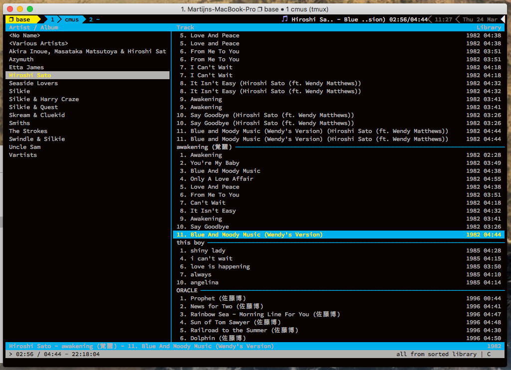

# Tmux Cmus

Adds an embeddable cmus status widget anywhere on your tmux status bar. Automatically truncates.

Only tested on OSX, windows support forthcomming (switching back to Windows personally)

### Example

The icon indicates whether cmus is actually playing

### Key bindings

Binds to F7, F8, F9 simulating the OSX media keyboard to stop/resume/next/prev

#### OS X requirements

The status bar attaches to a running cmus instance, so you'll need cmus installed and running

### Installation with [Tmux Plugin Manager](https://github.com/tmux-plugins/tpm) (recommended)

Add plugin to the list of TPM plugins in `.tmux.conf`:

    set -g @plugin 'Mpdreamz/tmux-cmus'

Hit `prefix + I` to fetch the plugin and source it. You should now be able to
use the plugin.

### Manual Installation

Clone the repo:

    $ git clone https://github.com/Mpdreamz/tmux-yank ~/clone/path

Add this line to the bottom of `.tmux.conf`:

    run-shell ~/clone/path/yank.tmux

Reload TMUX environment:

    # type this in terminal
    $ tmux source-file ~/.tmux.conf

You should now be able to use the plugin.

## Add the widget

Add `#{cmus_status}` to either `status_right` or `status_left`

### License

[MIT](LICENSE.md)
